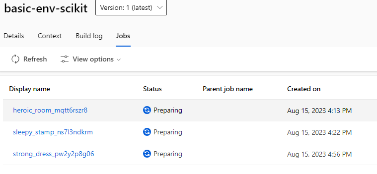
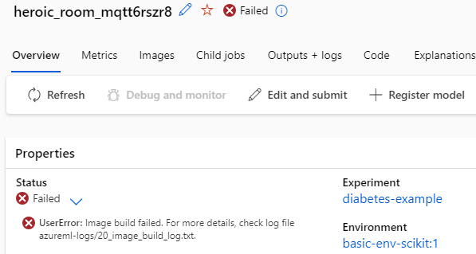
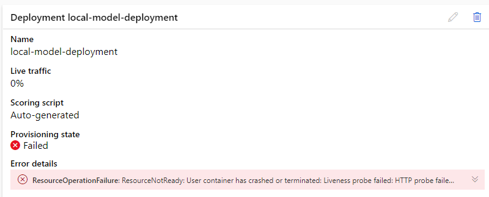
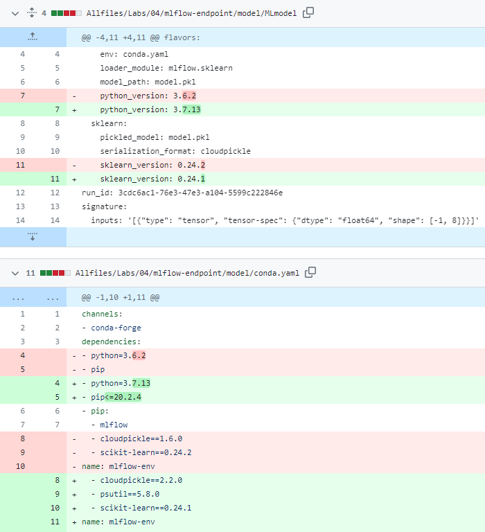

## Lab 01. Create an Azure Machine Learning workspace and assets with the CLI (v2)

```azurecli
az extension list
az extension list -o table
az extension list --query "[].{name: name, version: version}" -o table
```

### Create an Azure resource group and set as default
```azurecli
az group list -o table
az group exists --name "rg-mlops-labs"
az group create --name "rg-mlops-labs" --location "eastus"
az configure --defaults group="rg-mlops-labs"
az configure --list-defaults
```

### Create an Azure Machine Learning workspace and set as default
No need to specify Resource Group since it was set as default.
```azurecli
az ml workspace create --name "mlw-mlops-labs"
az configure --defaults workspace="mlw-mlops-labs"
az configure --list-defaults -o table
```

### Create a compute instance in your workspace:  
No need to specify Resource Group and ML Workspace since they were set as defaults.

```azurecli
az ml compute create --name "ci71974" --size STANDARD_DS11_V2 --type ComputeInstance
```

### Create an environment
```azurecli
az ml environment create --file ./Allfiles/Labs/01/basic-env.yml
```

### Create a dataset
```azurecli
az ml data create --file ./Allfiles/Labs/01/data-local-path.yml
az ml data list -o table
```
This is equivalent ([reference](https://learn.microsoft.com/en-us/cli/azure/ml/data?view=azure-cli-latest#az-ml-data-create)):
```azurecli
az ml data create --name diabetes-data-2 --version 1 --path ./Allfiles/Labs/01/data -d "Dataset pointing to diabetes data stored as CSV on local computer. Data is uploaded to default datastore."
```

### Clean up resources
```azurecli
az ml compute stop --name "ci71974" --no-wait
az ml workspace delete -n mlw-mlops-labs -g rg-mlops-labs
```

## Lab 02. Run a basic Python training job

### Start the instance again

```azurecli
az ml compute start --name "ci71974"
```
Or create if deleted:
```azurecli
az ml compute create --name "ci71974" --size STANDARD_DS11_V2 --type ComputeInstance
```

### Train a model
```azurecli
az ml job create --file ./Allfiles/Labs/02/basic-job/basic-job.yml --web
az ml job list -o table
```

### Train a model with dataset from datastore
```azurecli
az ml job create --file ./Allfiles/Labs/02/input-data-job/data-job.yml -o table
```

**Result:**  
Both jobs are stuck in the "Preparing" status. The logs show that the environment is being solved.  
  
Let's try with `AzureML-sklearn-0.24-ubuntu18.04-py37-cpu` environment to see if the custom environment is what is not working.

```azurecli
az ml job create --file ./Allfiles/Labs/02/input-data-job/data-job-AzureML-env.yml
```

**Result:**  
The job was successfully executed when using the "AzureML-sklearn-0.24-ubuntu18.04-py37-cpu" environment, but it failed when using the custom environment.


Worked with: `environment: azureml:AzureML-sklearn-0.24-ubuntu18.04-py37-cpu@latest`  
Didn't work with: `environment: azureml:basic-env-scikit@latest`  

- Jobs are stuck in the **Preparing** status:  

  
  
- And after 1:30 h they fail:



See the log here: [20_image_build_log.txt](./Allfiles/20_image_build_log.txt)


### Clean up resources (full resource group)
```azurecli
az group delete -n rg-mlops-labs
```


## Lab 03. Run a sweep job to tune hyperparameters

### Prerequisites
To train multiple models in parallel, you’ll use a compute cluster to train the models. 

```azurecli
az ml compute create --name "aml-cluster-71974" --size STANDARD_DS11_V2 --max-instances 2 --type AmlCompute
az ml compute list -o table
az ml compute list-nodes -n aml-cluster-71974 -o table
```

### Run a sweep job

- **mslearn-aml-cli/Allfiles/Labs/02/sweep-job** -> **sweep-job.yml**

```azurecli
az ml job create --file ./Allfiles/Labs/02/sweep-job/sweep-job.yml
```

### Clean up resources
```azurecli
az ml compute delete --name "aml-cluster-71974" --no-wait --yes
az ml compute list -o table
```

## Lab 04. Track Azure ML jobs with MLflow

### Start the instance again
```azurecli
az ml compute start --name "ci71974"
```

### Enable autologging

- Note that **mlflow-job.yml** points to **mlflow-autolog.py**
```azurecli
az ml job create --file ./Allfiles/Labs/03/mlflow-job/mlflow-job.yml
az ml job list -o table
```

### Use logging functions to track custom metrics

- Note that **custom-mlflow-job.yml** points to **custom-mlflow.py**
```azurecli
az ml job create --file ./Allfiles/Labs/03/mlflow-job/custom-mlflow-job.yml
az ml job list -o table
```


### Extra from *[Manage models with MLflow](https://learn.microsoft.com/en-us/training/modules/use-mlflow-azure-machine-learning-jobs-submitted-cli-v2/3-manage-models-mlflow)*


The output in the shell will show you the summary information of the job you submitted. It will show you the inputs you defined in the **mlflow-job.yml** file, and the details that Azure Machine Learning adds, like the name.  
  
To download the output files using the CLI (2), first, set the current directory of the shell to where you want to download all job-related files to. Then, to actually download the files for a specific job, you use the following command:

```azurecli
az ml model list -o table
az ml job list -o table
```

```azurecli
az ml job download --name mango_pizza_t4ddxk7vq5
az ml model download --name azureml_sweet_rainbow_pxwv7qzw58_2_output_mlflow_log_model_453546216 --version 1
```

To register a model, use the `ml model create` command.
(By looking at the documentation it seems that `--local-path` is not the correct argument but `--path` instead)
```azurecli
az ml model create --name <model_name> --version 1 --local-path <name>/model/
```
  
How would it be to register the model without downloading it? Maybe like this:

```azurecli
az ml model create --name <model_name> --version 1 --path runs:/<run_name>/model/ --type mlflow_model
```

### Clean up resources
```azurecli
az ml compute delete --name "ci71974" --no-wait --yes
```

## Lab 05. Deploy a model to a managed online endpoint

### Deploy a model

#### create the endpoint
...the name of the endpoint (setted in **create-endpoint.yml**) must be unique in the Azure region.

```azurecli
az ml online-endpoint create --name diabetes-mlflow-71974-1 -f ./Allfiles/Labs/04/mlflow-endpoint/create-endpoint.yml
```
**Note:** The name can be set in the command line or in the JSON file. In this lab, it is set in both places, but the command line value takes precedence.  
  
So this would be enough:  

```azurecli
az ml online-endpoint create -f ./Allfiles/Labs/04/mlflow-endpoint/create-endpoint.yml
```  
  
Delete the one defined with the json (don't delete if you want to try the deployment of a not local azureml model):  
```azurecli
az ml online-endpoint delete --name diabetes-mlflow-71974-2
az ml online-endpoint list -o table
```

#### deploy the model

Note: The model deployed here is in local folder **./model**.  

```azurecli
az ml online-deployment create --name local-model-deployment --endpoint diabetes-mlflow-71974-1 -f ./Allfiles/Labs/04/mlflow-endpoint/mlflow-deployment.yml --all-traffic
```
  
If `Standard_F2s_v2` is specified in the **.yml**, the deployment ends with error:  
`2023-08-16T14:52:20Z OutOfQuota: Container terminated due to insufficient memory. Please see troubleshooting guide, available here: https://aka.ms/oe-tsg#error-outofquota`   
  
The `instance_type` is asked to be changed to `Standard_F4s_v2` in the Lab5 Pull Requests, perhaps because this is a more powerful instance type that do handle the workload.  
  
**Now the error is `WARNING: Package(s) not found: azureml-inference-server-http`.**  

  
  
Probably applying the changes in the PR makes it work:  

  

Which looks very similar to the files corresponding to the downloaded model:  
[conda.yaml](./Allfiles/Labs/04/mlflow-endpoint/sweet_rainbow_pxwv7qzw58_2_output_mlflow_log_model_453546216/model/conda.yaml)  
[MLmodel](./Allfiles/Labs/04/mlflow-endpoint/sweet_rainbow_pxwv7qzw58_2_output_mlflow_log_model_453546216/model/MLmodel)
  

Let's try with a local model, the downloaded in a previos session (the deployment name is already in the json):  

```azurecli
az ml online-deployment create --endpoint diabetes-mlflow-71974-1 -f ./Allfiles/Labs/04/mlflow-endpoint/mlflow-deployment-2.yml --all-traffic
```

**Great!!. It worked just fine.**


#### What if I want to deploy a model that is not local?

1. Register the model  

- Create a model using mlflow run URI format 'runs:/<run-id>/<path-to-model-relative-to-the-root-of-the-artifact-location>' and command options
```
az ml model create --name azure-run-model --version 1 --path runs:/upbeat_guava_vthq7j975r/model/ --type mlflow_model
```
2. Deploy the azureml model specified in **mlflow-deployment-azureml.yml**  
  
```azurecli
az ml online-deployment create --name mlflow-deployment-2 --endpoint diabetes-mlflow-71974-2 -f ./Allfiles/Labs/04/mlflow-endpoint/mlflow-deployment-azureml.yml --all-traffic
```

**Great!!. It worked just fine.**


### Extra from [*Deploy your model to a managed endpoint*](https://learn.microsoft.com/en-us/training/modules/deploy-azure-machine-learning-model-managed-endpoint-cli-v2/3-deploy-model-managed-endpoint)

For example, if after testing you want to reroute all traffic to the green deployment, which uses the newest version of the model, use the following command:

```azurecli
az ml online-endpoint update --name diabetes-mlflow --traffic "blue=0 green=100"
```
  
### Test the endpoint
  
Again, looking at the PR it seems that the **sample-data.json** isn't in the correct format. Added **sample-data-new.json**.
```azurecli
az ml online-endpoint invoke --name diabetes-mlflow-71974-2 --request-file ./Allfiles/Labs/04/mlflow-endpoint/sample-data-new.json
```
Output:  
```
"[1, 0]"
```

**Great!!. It worked just fine.**  

```azurecli
az ml online-endpoint invoke --name diabetes-mlflow-71974-1 --request-file ./Allfiles/Labs/04/mlflow-endpoint/sample-data-new.json
```
Output:  
```
"[1, 0]"
```
**Great!!. It also worked fine.**  


### Clean up resources

Delete deployment:
```azurecli
az ml online-deployment delete --name <deplyment_name> --endpoint-name <endpoint_name> --yes
```

```azurecli
az ml online-endpoint delete --name diabetes-mlflow-71974-2 --yes --no-wait
az ml online-endpoint delete --name diabetes-mlflow-71974-1 --yes --no-wait
```
  
## Lab 06. Run a pipeline with components
  
### Start compute instance (if needed)

```azurecli
az ml compute start --name "ci71974"
``` 

### Run a pipeline

```azurecli
az ml job create --file ./mslearn-aml-cli/Allfiles/Labs/05/job.yml
``` 

### Create components
To reuse the pipeline’s components, you can create the component in the Azure Machine Learning workspace. 

```azurecli
az ml component create --file ./mslearn-aml-cli/Allfiles/Labs/05/summary-stats.yml
az ml component create --file ./mslearn-aml-cli/Allfiles/Labs/05/fix-missing-data.yml
az ml component create --file ./mslearn-aml-cli/Allfiles/Labs/05/normalize-data.yml
az ml component create --file ./mslearn-aml-cli/Allfiles/Labs/05/train-decision-tree.yml
az ml component create --file ./mslearn-aml-cli/Allfiles/Labs/05/train-logistic-regression.yml
``` 
Obtain a list of all existing components:
```azurecli
az ml component list -g <resorce-group> -w <workspace-name>
```

### Create a new pipeline with the Designer

### Clean up resources

```azurecli
az ml compute stop --name "testdev-vm" --no-wait
az ml workspace delete
```

Or better yet, delete the entire resorce group:
```azurecli

```
